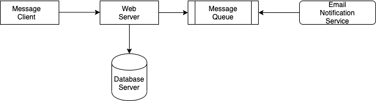

# Xela-Mail-Notifier

This project is an offline notification service aimed at informing users/reciepients about missed messages on some application, Example of this is when a user leaves their workstation, upon which they receive a message from a co-worker. The application thereby sends an email to the user to notify him/her about an awaiting message which requires their attention, and the contents of the message are sent via email to the required user.

This is a project borne out of learning on System Design: Event Driven Architecture

## Architecture

</img>

## App Components

- A backend POST end-point which accepts the message and the email of the receipient.
- An event emitter which adds a message to the Queueing Service for notification of the receipient.
- A database server which logs messages for data retention.
- An email service which checks for newly received messages, dispatches an email to the receipient and pops out sent message requests.

## Technologies Used

- Framework and Programming language
  - JavaScript, ES6.
  - Node.js, Express Framework.
  - Redis (RSMQ) library for Nodejs
- Database and Database client
  - Redis
  - Mongodb

## Author

- Moshood Alaran

## Acknowledgements

- Appreciation goes to Mayowa Tudonu for the sessions.
